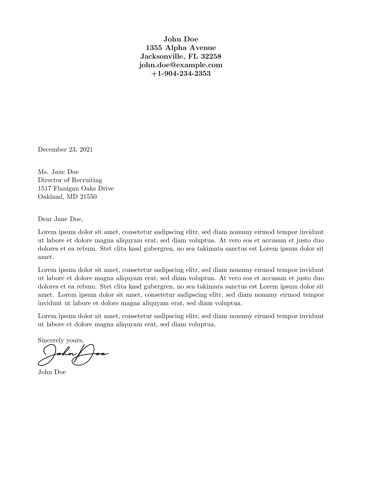
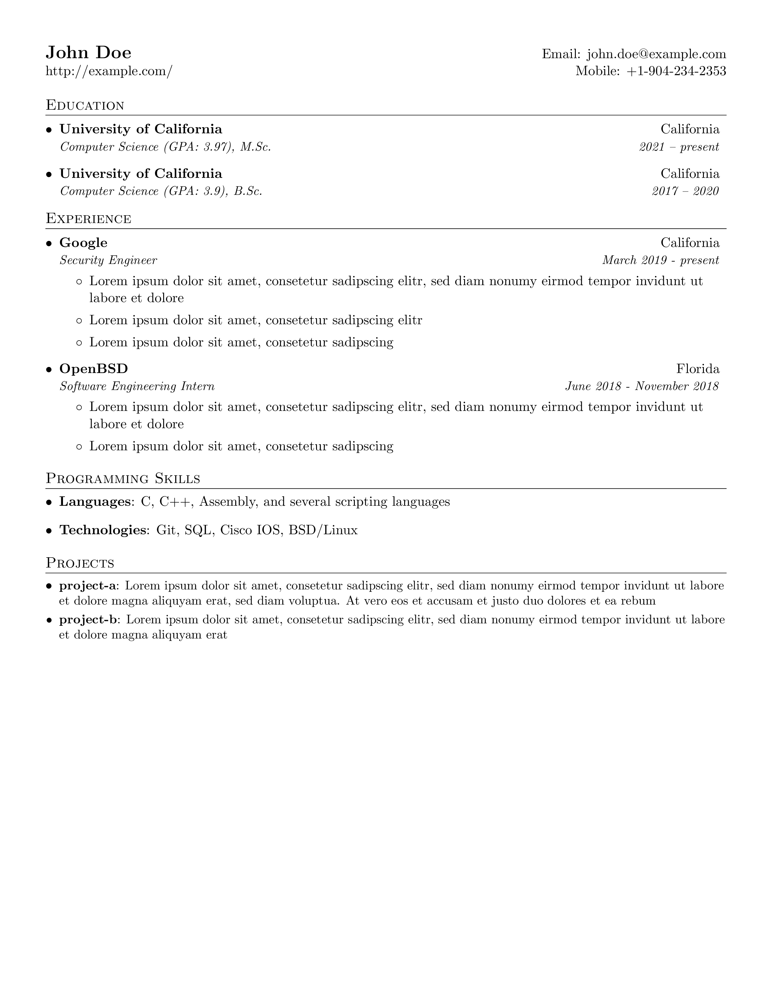

## TeX
Simple and functional LaTeX document templates 
### Dependencies
* pdflatex (usually part of TeXLive)
* (optional) ImageMagick for converting to PNG/JPG format 
* (optional) GhostScript (ImageMagick may require it)
* (optional) aspell for spell-checking
* (optional) make
### Example workflow
```
# Perform spell-checking 
aspell --lang=en --mode=tex check coverletter.tex

# Convert LaTeX to PDF
pdflatex coverletter.tex

# Convert PDF to PNG (without transparent background)
convert coverletter.pdf -density 300 -quality 90 -alpha remove -alpha off coverletter.png
```
### Preview
* [Coverletter](preview/coverletter.pdf)

* [Resume/CV](preview/resume.pdf)

### License
This project is licensed under the BSD 2-Clause License - see the LICENSE file for details
